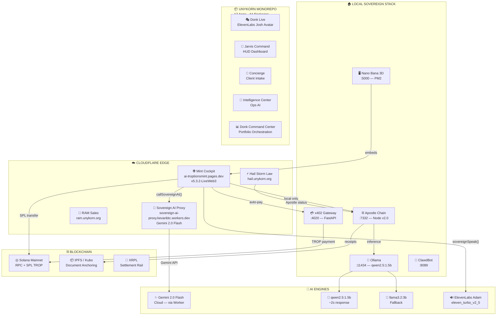
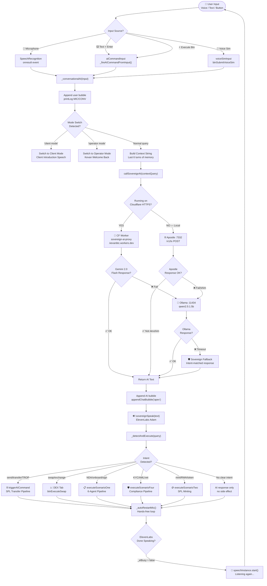
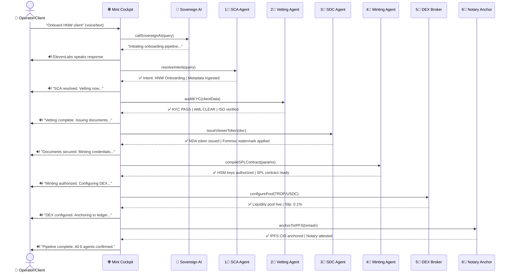
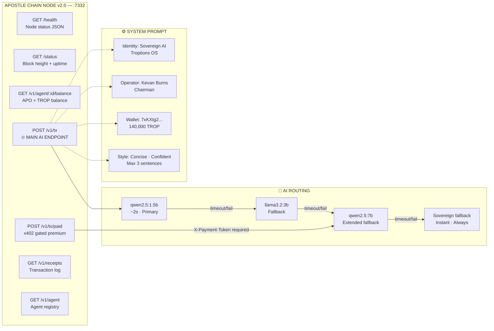
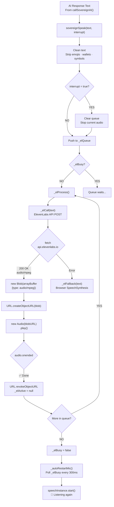
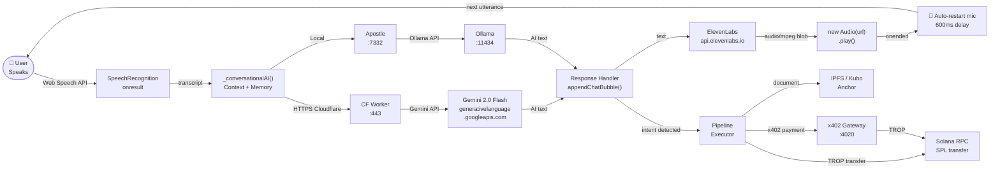
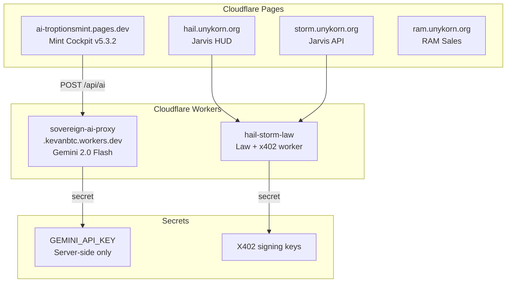

# 🔥 BADASS AI — Sovereign Troptions OS

<div align="center">


**The world's first fully autonomous sovereign AI financial operating system for the Troptions ecosystem.**  
A monorepo of 17 apps, 44 packages, 4 Cloudflare workers — all connected to a single AI brain.

Built by **Kevan Burns** · Chairman & Principal Operator · [FTH Trading](https://fthtrading.com) · [unykorn.org](https://unykorn.org)

[🌐 **Live Cockpit**](https://ai-troptionsmint.pages.dev) &nbsp;·&nbsp; [🤖 **AI Proxy**](https://sovereign-ai-proxy.kevanbtc.workers.dev/api/health) &nbsp;·&nbsp; [⛓ **Apostle Health**](http://127.0.0.1:7332/health)

</div>

---

## 📑 Table of Contents

| # | Section | What You'll Find |
|---|---------|-----------------|
| 1 | [🌐 Ecosystem Overview](#-ecosystem-overview) | The full Troptions / UnyKorn universe |
| 2 | [🗺 Full System Map](#-full-system-map) | Every app, service, and chain |
| 3 | [🤖 AI Flow Tree](#-ai-flow-tree) | How AI routes from voice → action |
| 4 | [🧠 Agent Mesh Map](#-agent-mesh-map) | 6-agent orchestration pipeline |
| 5 | [💸 x402 Payment Flow](#-x402-payment-flow) | Autonomous micropayment protocol |
| 6 | [⛓ Apostle Chain Architecture](#-apostle-chain-architecture) | On-chain sovereign node |
| 7 | [🔊 Voice Pipeline](#-voice-pipeline) | ElevenLabs → speaker loop |
| 8 | [📡 Data Flow Diagram](#-data-flow-diagram) | End-to-end request lifecycle |
| 9 | [🏗 Apps Directory](#-apps-directory) | All 17 apps |
| 10 | [📦 Packages Directory](#-packages-directory) | All 44 shared packages |
| 11 | [☁ Cloudflare Stack](#-cloudflare-stack) | Pages + Workers |
| 12 | [📁 Repository Structure](#-repository-structure) | This repo file map |
| 13 | [🚀 Getting Started](#-getting-started) | Run it locally |
| 14 | [🌩 Deployment](#-deployment) | Push to production |
| 15 | [🔑 Environment Variables](#-environment-variables) | Full config reference |
| 16 | [🗺 Roadmap](#-roadmap) | What's next |

---

## 🌐 Ecosystem Overview

The **Troptions OS** is a multi-layer sovereign financial operating system. Every component is interconnected through the Apostle Chain (ID 7332) and the AI mesh.

```
┌──────────────────────────────────────────────────────────────────────────────────┐
│                         TROPTIONS SOVEREIGN ECOSYSTEM                             │
│                                                                                    │
│   ┌─────────────────┐     ┌────────────────────┐     ┌──────────────────────┐    │
│   │   MINT COCKPIT  │     │   NANO BANA 3D     │     │  UNYKORN AI PORTAL   │    │
│   │ ai-troptionsmint│     │  :5000 (Troptions  │     │  unykorn.ai (apex)   │    │
│   │  .pages.dev     │     │   OS shell)        │     │                      │    │
│   └────────┬────────┘     └────────┬───────────┘     └──────────┬───────────┘    │
│            │                       │                              │               │
│            └───────────────────────┴──────────────────────────────┘              │
│                                           │                                       │
│                              ┌────────────▼──────────────┐                       │
│                              │      APOSTLE CHAIN         │                       │
│                              │      ID 7332 : :7332       │                       │
│                              │   Sovereign AI Node v2.0   │                       │
│                              └────────────┬──────────────┘                       │
│                                           │                                       │
│            ┌──────────────────────────────┼───────────────────────────┐          │
│            │                              │                            │          │
│   ┌────────▼───────┐          ┌──────────▼────────┐       ┌──────────▼───────┐  │
│   │  OLLAMA LOCAL  │          │  x402 GATEWAY     │       │  GEMINI 2.0      │  │
│   │  :11434        │          │  :4020 FastAPI     │       │  FLASH (Worker)  │  │
│   │  qwen2.5:1.5b  │          │  Auto-pay TROP     │       │  Cloud AI        │  │
│   └────────────────┘          └───────────────────┘       └──────────────────┘  │
│                                           │                                       │
│            ┌──────────────────────────────┼───────────────────────────┐          │
│            │                              │                            │          │
│   ┌────────▼───────┐          ┌──────────▼────────┐       ┌──────────▼───────┐  │
│   │  ELEVENLABS    │          │  SOLANA RPC        │       │  AGAPE BACKBONE  │  │
│   │  Adam Voice    │          │  Mainnet + TROP    │       │  DID + Storage   │  │
│   │  eleven_turbo  │          │  SPL Transfers     │       │  + Vault         │  │
│   └────────────────┘          └───────────────────┘       └──────────────────┘  │
└──────────────────────────────────────────────────────────────────────────────────┘
```

---

## 🗺 Full System Map



---

## 🤖 AI Flow Tree

Every user interaction — voice or text — flows through this exact decision tree:



---

## 🧠 Agent Mesh Map

The 6-agent pipeline executes **sequentially** for complex scenarios (NDA, onboarding, compliance):



---

## 💸 x402 Payment Flow

x402 is the **AI-native autonomous payment protocol** — no human approves a payment, the agent does it:

```mermaid
flowchart LR
    subgraph "🌐 Mint Cockpit"
        REQ["User Request\nPremium AI Inference"]
        AUTO["Auto-Pay Logic\ncallSovereignAI()"]
    end

    subgraph "💳 x402 Gateway :4020"
        RECV["POST /v1/pay\n{service, amount_atp}"]
        AUTH["Authorize\nVerify ATP balance"]
        ROUTE["Route Payment"]
    end

    subgraph "◎ Solana"
        SPL["SPL Transfer\nTROP tokens"]
        WALLET["Operator Wallet\n7xKXtg2...gAsU"]
        RECEIPT["On-chain Receipt\nTransaction Hash"]
    end

    subgraph "⛓ Apostle :7332"
        PAID["/v1/tx/paid\nX-Payment-Token header"]
        AI["Premium Inference\nqwen2.5-coder:14b"]
        RESP["AI Response\nreturned to cockpit"]
    end

    REQ --> AUTO
    AUTO -->|"402 Payment Required"| RECV
    RECV --> AUTH
    AUTH --> ROUTE
    ROUTE --> SPL
    SPL --> WALLET
    WALLET --> RECEIPT
    RECEIPT -->|"X-Payment-Token"| PAID
    PAID --> AI
    AI --> RESP
    RESP -->|"🔊 ElevenLabs speaks"| REQ
```



**PayRequest Schema:**
```json
{
  "service": "sovereign-inference",
  "amount_atp": "5000000",
  "payer_agent_id": "mint-cockpit-v5"
}
```

---

## ⛓ Apostle Chain Architecture



**Chain specs:**

| Property | Value |
|----------|-------|
| Chain ID | `7332` |
| Version | `2.0.0` |
| Port | `7332` |
| Primary Model | `qwen2.5:1.5b` (~2s) |
| Timeout | 60s (handles cold model load) |
| Warm-up | Auto on startup |
| Process Manager | Node.js (direct / PM2) |

---

## 🔊 Voice Pipeline



**Voice Settings:**

| Setting | Value | Effect |
|---------|-------|--------|
| Voice | Adam `pNInz6obpgDQGcFmaJgB` | Deep, authoritative |
| Model | `eleven_turbo_v2_5` | Low latency |
| Stability | `0.52` | Natural variation |
| Similarity Boost | `0.85` | Strong voice match |
| Speed | `1.05x` | Slightly faster |
| Playback | `new Audio(blob)` | Native MP3, no WebAudio decode |

---

## 📡 Data Flow Diagram

Complete end-to-end lifecycle of a single voice command:



---

## 🏗 Apps Directory

The full UnyKorn + Troptions monorepo contains **17 production apps**:

| App | Domain / Port | Stack | Purpose |
|-----|--------------|-------|---------|
| 🌐 **Mint Cockpit** | `ai-troptionsmint.pages.dev` | HTML/JS/CF Pages | **Primary AI cockpit** — TROP operations, NDA, DEX |
| 🖥 **Nano Bana 3D** | `:5000` (PM2) | TypeScript/Vite | Local Troptions OS shell — embeds Mint Cockpit |
| 🤖 **Sovereign AI Proxy** | `kevanbtc.workers.dev` | CF Worker | Gemini 2.0 Flash proxy — HTTPS-safe AI |
| ⛓ **Apostle Node** | `:7332` | Node/Express | Sovereign chain AI — Ollama inference |
| 🎭 **Donk Live** | `donk.unykorn.org` | TypeScript | ElevenLabs Josh avatar + animated face |
| 📊 **Donk Command Center** | `donk-cc` | TypeScript | Portfolio orchestration UI |
| 🎯 **Jarvis Command** | `hail/storm/law.unykorn.org` | Hono/TS | System status HUD + sprint logs |
| 🧠 **Intelligence Center** | `intel.unykorn.org` | TypeScript | Ops AI dashboard |
| 🌟 **UnyKorn AI Portal** | `unykorn.ai` | TypeScript | Apex sovereign ops portal |
| 🐏 **RAM Sales** | `ram.unykorn.org` | TypeScript | Sales + proof surface |
| 🤵 **Concierge** | Internal | TypeScript | Client intake automation |
| 💳 **Credit API** | Internal | TypeScript | Credit scoring API |
| 💰 **Credit Admin** | Internal | TypeScript | Credit admin panel |
| 📒 **UNY Ledger** | Internal | TypeScript | Transaction ledger UI |
| 🏫 **Ridgemont High** | `ridgemont.unykorn.org` | TypeScript | Satirical AI Academy |
| 🔗 **XRPL Hub** | Internal | TypeScript | Cross-chain XRPL interface |
| 🧪 **MCP Hub** | Internal | TypeScript | MCP server aggregator |

---

## 📦 Packages Directory

44 shared packages that power the entire ecosystem:

| Category | Packages |
|----------|---------|
| 🤖 **AI & Agents** | `agent-core` · `agent-roles` · `inference-router` · `speech-router` · `clawdbot` · `clawdhub` · `nemoclaw` |
| 💳 **Payments & Credit** | `x402-credit-gateway` · `x402-agent-ecosystem` · `credit-core` · `credit-auth` · `credit-ledger` · `credit-persistence` · `receipts` |
| 🔐 **Identity & Security** | `identity-engine` · `agape-did` · `security-config` · `wallet-policy` · `policy-engine` · `risk-engine` · `signing-client` |
| 💰 **Finance & Settlement** | `settlement-engine` · `treasury-core` · `genesis-ledger` · `genesis-wallet` · `uny-economics` · `rail-adapters` |
| 🏦 **Exchange** | `exchange-listing` · `exchange-readiness` · `fth-x402-mesh-pulse` · `fth-x402-site` |
| 📦 **Storage & Data** | `agape-storage` · `agape-anchor` · `db` · `audit-events` · `proofs` · `telemetry` · `3fs-channel` |
| 🔗 **Blockchain** | `unyKorn-contracts` · `unykorn-explorer` · `unykorn-ico` |
| 🛠 **Infra** | `shared-types` · `mcp-servers` · `a2a-sdk` |

---

## ☁ Cloudflare Stack



| Worker | URL | Purpose |
|--------|-----|---------|
| `sovereign-ai-proxy` | `kevanbtc.workers.dev` | Gemini 2.0 Flash AI (HTTPS-safe, key server-side) |
| `hail-storm-law` | `law.unykorn.org` | x402 verification + Apostle status proxy |

---

## 📁 Repository Structure

```
badass-Ai-/                              ← This repo
│
├── 📂 public/                           ← 🌐 Mint Cockpit (Cloudflare Pages)
│   ├── 🟨 app.js                        ← Full sovereign AI engine (5,500+ lines)
│   │   ├── _conversationalAI()          ← Main AI conversation loop
│   │   ├── callSovereignAI()            ← Cascading AI router
│   │   │   ├── CF Worker → Gemini       ← HTTPS route
│   │   │   ├── Apostle :7332            ← Local route
│   │   │   ├── Ollama :11434            ← Local fallback
│   │   │   └── Sovereign fallback       ← Always works
│   │   ├── sovereignSpeak()             ← ElevenLabs engine
│   │   ├── _elCall()                    ← Audio(blob).play()
│   │   ├── _autoRestartMic()            ← Hands-free loop
│   │   ├── _detectAndExecute()          ← Intent → pipeline
│   │   ├── executeScenarioOne()         ← NDA / HNW onboarding
│   │   ├── executeScenarioTwo()         ← SPL token minting
│   │   ├── executeScenarioFour()        ← KYC/AML compliance
│   │   └── triggerAICommand()           ← TROP transfer pipeline
│   ├── 🟦 index.html                    ← Cockpit UI (900 lines)
│   └── 🟪 style.css                     ← Sovereign design system
│
├── 📂 worker/                           ← 🤖 Cloudflare Worker
│   ├── 🟨 index.js                      ← Gemini 2.0 Flash proxy
│   │   ├── POST /api/ai                 ← Main inference endpoint
│   │   └── GET  /api/health             ← Health check
│   └── 📄 wrangler.toml
│
├── 📂 apostle-node/                     ← ⛓ Apostle Chain Node v2.0
│   ├── 🟨 server.js                     ← Sovereign AI server (:7332)
│   │   ├── POST /v1/tx                  ← Live Ollama inference
│   │   ├── POST /v1/tx/paid             ← x402 gated premium
│   │   ├── GET  /health                 ← Node status
│   │   ├── GET  /v1/agent               ← Agent registry
│   │   └── GET  /v1/agent/:id/balance   ← APO + TROP balance
│   └── 📄 package.json
│
├── 📂 gcp-config/                       ← ☁ Infrastructure as Code
│   ├── 📄 api-gateway-openapi.yaml      ← Apigee API spec
│   ├── 📄 cloudbuild.yaml               ← GCP CI/CD pipeline
│   ├── 📄 Dockerfile.agent              ← Containerized agent
│   ├── 📄 firebase.json                 ← Firebase config
│   ├── 📂 terraform/
│   │   └── 📄 main.tf                   ← GCP resource provisioning
│   └── 📂 solana_program/
│       └── src/
│           └── 🦀 lib.rs               ← On-chain Rust program
│
├── 📂 docs/                             ← 📋 Architecture docs
│   ├── 📂 apps/                         ← App package manifests
│   └── 📂 nano-bana-3d/                 ← Troptions OS shell config
│
├── 📄 .gitignore
└── 📄 README.md                         ← This file
```

---

## 🚀 Getting Started

### Prerequisites

```bash
node >= 18
npm >= 9
ollama          # https://ollama.ai/download
git
```

### 1. Clone

```bash
git clone https://github.com/FTHTrading/badass-Ai-.git
cd badass-Ai-
```

### 2. Pull AI Models

```bash
ollama pull qwen2.5:1.5b    # Primary — ~2s responses
ollama pull llama3.2:3b     # Fallback — better quality
```

### 3. Start Apostle Chain Node

```bash
cd apostle-node
npm install express          # if not already installed
node server.js
```

```
🔥 APOSTLE CHAIN v2.0 — SOVEREIGN AI NODE ONLINE
   http://127.0.0.1:7332
   AI: qwen2.5:1.5b → llama3.2:3b → qwen2.5:7b
   x402: http://127.0.0.1:4020
   Chain ID: 7332
```

### 4. Serve the Cockpit

```bash
npx serve public -l 5000
# open http://127.0.0.1:5000
```

### 5. Click "INITIALIZE SYSTEM CORE"

Adam's voice greets you:
> *"Good afternoon, Kevan. Sovereign AI is online. All agents are standing by. The Troptions mesh is synchronized and ready for your command."*

### 6. Try These Commands

```
"What is the status of all systems?"
"Send 1000 TROP to 7xKXtg2CW87d97TXJSDpbD5jBkheTqA83TZRuJosgAsU"
"Onboard a new HNW client"
"Swap 1000 USDC for TROP"
"Client mode"           ← switches to client intro
"Operator mode"         ← back to Kevan mode
```

---

## 🌩 Deployment

### Cloudflare Pages (Mint Cockpit)

```bash
export CLOUDFLARE_API_TOKEN=your_cf_token
npx wrangler pages deploy public --project-name=ai-troptionsmint
```

### Cloudflare Worker (AI Proxy)

```bash
cd worker
export CLOUDFLARE_ACCOUNT_ID=07bcc4a189ef176261b818409c95891f
npx wrangler deploy
npx wrangler secret put GEMINI_API_KEY
# Paste your Google AI Studio key
```

### Local PM2 (Apostle + Nano Bana)

```bash
# Apostle
pm2 start apostle-node/server.js --name=apostle-chain
pm2 save && pm2 startup

# Nano Bana 3D
pm2 start troptions-os/pm2.config.cjs
pm2 save
```

### Verify All Services

```bash
curl http://127.0.0.1:7332/health    # Apostle
curl http://127.0.0.1:4020/health    # x402
curl http://127.0.0.1:11434/api/tags # Ollama models
curl https://sovereign-ai-proxy.kevanbtc.workers.dev/api/health
```

---

## 🔑 Environment Variables

### Cloudflare Worker Secrets

```bash
npx wrangler secret put GEMINI_API_KEY      # Google AI Studio
```

### Apostle Node (env vars or defaults)

| Variable | Default | Description |
|----------|---------|-------------|
| `OLLAMA_URL` | `http://127.0.0.1:11434` | Ollama inference |
| `X402_URL` | `http://127.0.0.1:4020` | Payment gateway |

### Cockpit (hardcoded in `public/app.js`)

| Constant | Value | Description |
|----------|-------|-------------|
| `_EL_API_KEY` | `sk_f076875...` | ElevenLabs API key |
| `_EL_VOICE_ID` | `pNInz6obpgDQGcFmaJgB` | Adam voice |
| `OPERATOR.name` | `Kevan` | Greeting name |
| `OPERATOR.email` | `kevan@unykorn.org` | Operator email |

---

## 🗺 Roadmap

| Phase | Feature | Status |
|-------|---------|--------|
| ✅ **P1** | Mint Cockpit v5.3.2 — full AI cockpit | **LIVE** |
| ✅ **P1** | Apostle Chain v2.0 — live Ollama inference | **LIVE** |
| ✅ **P1** | Gemini 2.0 Flash cloud AI via CF Worker | **LIVE** |
| ✅ **P1** | ElevenLabs Adam voice — MP3 Audio element | **LIVE** |
| ✅ **P1** | Conversational AI — context memory + hands-free | **LIVE** |
| ✅ **P1** | Personalized greeting (Kevan/client modes) | **LIVE** |
| ✅ **P1** | x402 autonomous payment routing | **LIVE** |
| ✅ **P1** | 6-agent NDA / onboarding pipeline | **LIVE** |
| ✅ **P1** | GitHub repo + professional docs | **LIVE** |
| 🔜 **P2** | Real SPL TROP transfers (Phantom wallet signing) | **Next** |
| 🔜 **P2** | IPFS document anchoring (Kubo v0.24) | **Next** |
| 🔜 **P2** | Live TROP/USDC price oracle (DEX feed) | **Next** |
| 🔜 **P2** | Nano Bana 3D public Cloudflare deployment | **Next** |
| 🔜 **P3** | Agent-to-agent A2A protocol (Google A2A SDK) | **Planned** |
| 🔜 **P3** | Cloudflare Durable Objects — persistent agent state | **Planned** |
| 🔜 **P3** | Multi-operator role-based access control | **Planned** |
| 🔜 **P3** | UnyKorn AI Portal full deployment | **Planned** |
| 🔜 **P3** | Donk Live ElevenLabs Josh avatar integration | **Planned** |
| 🔜 **P4** | On-chain Rust program (Solana) deployment | **Research** |
| 🔜 **P4** | XRPL settlement rail integration | **Research** |

---

## 🏢 About

<div align="center">

**From The Hart (FTH) Trading**

Built by **Kevan Burns** · Chairman & Principal Operator

[kevan@unykorn.org](mailto:kevan@unykorn.org) · [fthtrading.com](https://fthtrading.com) · [unykorn.org](https://unykorn.org)

*Troptions is a registered commodity currency. All blockchain operations comply with applicable US barter and commodity exchange law.*

---

**⚡ Powered by Troptions OS · Apostle Chain ID 7332 · UnyKorn Sovereign Financial Platform**

</div>
